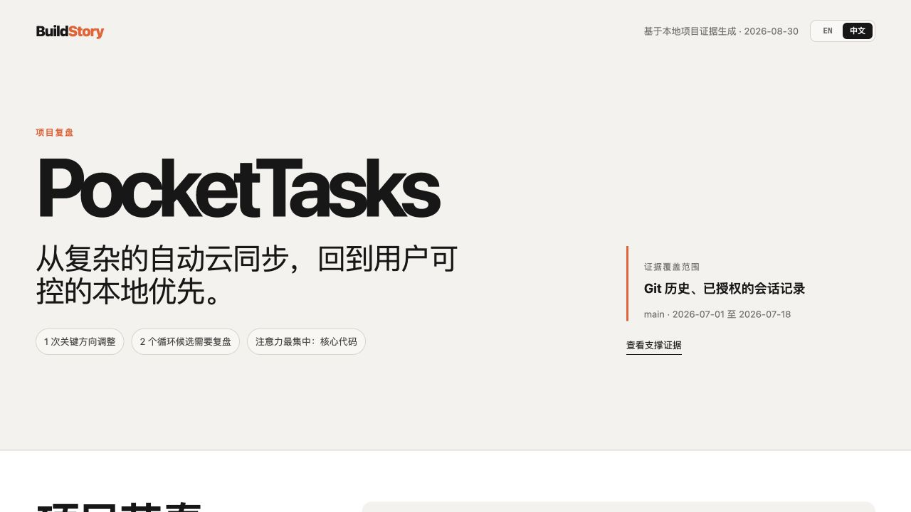

# BuildStory

**See how you built it, not just what you built.**

BuildStory is a local-first Agent Skill and report generator that reconstructs a software project's development history. It turns Git history and optional AI coding-session transcripts into a project story, a small set of turning points, rework and rollback signals, attention estimates, an evidence-backed process profile, and material for retrospectives, portfolios, resumes, and interviews.

[简体中文](README.md)



## Why BuildStory

The finished repository shows what survived. It usually hides:

- the feature that was rebuilt three times;
- the component that absorbed most of the project's attention;
- the decision that simplified the entire system;
- the experiments that were discarded;
- the real evidence behind a resume claim.

BuildStory makes that invisible process inspectable without pretending Git can read a developer's mind.

## What it produces

One run creates a default report plus English and Chinese variants. The `--language` option chooses which language opens as `report.html`:

```text
build-story-report/
├── evidence.json       # evidence in the selected default language
├── evidence.en.json    # English evidence
├── evidence.zh.json    # Chinese evidence
├── report.md           # Markdown in the selected default language
├── report.en.md        # English Markdown
├── report.zh.md        # Chinese Markdown
├── report.html         # default report with EN / 中文 switch
├── report.en.html      # English visual report
└── report.zh.html      # Chinese visual report
```

The report includes:

1. a story-first opening that explains what changed;
2. five to seven turning points that changed direction, risk, understanding, or delivery state;
3. explicit reversals and high-churn loop candidates;
4. estimated attention areas and active time;
5. evidence levels and actions for delivery, validation, traceability, iteration, and learning capture;
6. evidence cards for portfolios, resume bullets, achievement records, and STAR interview stories.

The complete commit log and numeric calculations remain available as collapsed evidence. BuildStory deliberately does **not** calculate one overall score.

## Quick start

Requirements:

- Python 3.10+
- Git
- a repository with at least one commit

Generate both languages and open English by default:

```bash
python3 scripts/build_story.py /path/to/project \
  --output /path/to/project/build-story-report \
  --language en
```

Generate both languages and open Chinese by default:

```bash
python3 scripts/build_story.py /path/to/project \
  --output /path/to/project/build-story-report \
  --language zh
```

Open `build-story-report/report.html` in a browser and use the **EN / 中文** switch in the top navigation. The language-specific files can also be opened or shared directly.

When `--language` is omitted, BuildStory opens Chinese by default.

### Add authorized AI-session evidence

BuildStory can read local `.jsonl`, `.json`, `.txt`, and `.md` transcripts when you explicitly provide their paths:

```bash
python3 scripts/build_story.py /path/to/project \
  --session /path/to/authorized/session.jsonl \
  --output /path/to/project/build-story-report \
  --language en
```

Repeat `--session` to add more authorized files or directories.

BuildStory does not automatically search private session directories.

### Add three confirmed facts

Git can show what changed, but it cannot prove your responsibility, the final outcome, or why a decision mattered. For resume, portfolio, or STAR output, confirm only:

1. What was your real responsibility?
2. What outcome did the project create for users or for you?
3. Which decision best demonstrates your ability?

Create `context.json`:

```json
{
  "en": {
    "role": "product direction, core implementation, and release validation",
    "outcome": "shipped 1.0 with user-controlled data export",
    "key_decision": "removed increasingly complex automatic sync in favor of explicit export",
    "summary": "From complex automatic sync back to a user-controlled local-first product.",
    "resume_bullets": [
      "Reversed automatic sync after queue and retry complexity grew, replacing it with explicit export."
    ]
  }
}
```

Regenerate the report:

```bash
python3 scripts/build_story.py /path/to/project \
  --context /path/to/project/context.json \
  --output /path/to/project/build-story-report \
  --language en
```

BuildStory then creates a portfolio summary, resume bullets, and a STAR story without treating commit volume as impact.

If Git subjects or AI conversations use another language, add exact source-to-display mappings under `translations`. The localized report shows the translated development story while retaining the original text in structured evidence. When authorized transcripts exist, turning points can also show the corresponding user request and AI response excerpts.

## Install as an Agent Skill

### Codex

```bash
git clone https://github.com/ZekerTop/build-story.git \
  "${CODEX_HOME:-$HOME/.codex}/skills/build-story"
```

Then invoke:

```text
$build-story Review this project and show where I repeatedly reworked decisions.
```

### Other Agent Skills-compatible clients

Clone or copy the `build-story` folder into the client's user-level or project-level skills directory. Keep `SKILL.md`, `scripts/`, `references/`, and `agents/` together.

Example prompts:

```text
Use $build-story to create a project retrospective from this repository.
```

```text
Use $build-story to identify repeated loops, likely time sinks, and the most defensible achievements from this project.
```

```text
Use $build-story to turn this project's evidence into a portfolio case study and three truthful resume bullets. Ask me only for impact that cannot be verified from the repository.
```

## Evidence model

BuildStory keeps three things separate:

| Type | Meaning | Example |
|---|---|---|
| Observation | Directly present in data | An explicit `Revert` commit |
| Inference | A repeatable signal that needs interpretation | A file with high bidirectional churn |
| Confirmed context | Supplied by the user | Why a design was abandoned |

Every inferred loop and time estimate includes a confidence level.

### Loop detection

The analyzer uses:

- explicit `revert`, `rollback`, and equivalent commit messages;
- repeated normalized commit topics;
- files changed repeatedly with substantial additions and deletions;
- repeated prompts in authorized session transcripts.

High churn can mean productive iteration. BuildStory calls these **loop candidates**, not mistakes.

### Time estimates

Git does not record thinking time. A Git-only estimate groups nearby commits into work sessions and is labeled low confidence.

Authorized timestamped transcripts improve coverage, but still miss offline thinking, meetings, research, and unrecorded experiments.

## Evidence-backed profile

BuildStory reports separate dimensions:

- **Delivery evidence:** release, packaging, documentation, and completion signals.
- **Validation discipline:** tests, CI, linting, and validation-related changes.
- **Change traceability:** descriptive commit messages and reviewable commit size.
- **Iteration control:** reversals and concentrated rework signals.
- **Learning capture:** README, changelog, ADRs, documentation, and retrospectives.

The report shows human-readable levels such as Strong, Clear, Needs review, and Limited evidence, then gives a reason and a concrete next action. Raw numbers appear only under “View calculation.”

These levels describe repository evidence. They do not measure a person's intelligence, seniority, or worth.

## Demo

The repository includes deterministic reports for a synthetic project called PocketTasks:

- [English HTML report](examples/demo-report/en/report.html)
- [English Markdown report](examples/demo-report/en/report.md)
- [Chinese HTML report](examples/demo-report/zh/report.html)
- [Chinese Markdown report](examples/demo-report/zh/report.md)

Regenerate them with:

```bash
python3 scripts/create_demo_report.py
```

## Privacy and safety

- Analysis runs locally.
- The generator makes no network requests.
- Source files are never modified.
- Output is written only to the selected directory.
- Absolute local paths are not included in generated reports.
- Full transcripts are not copied into reports.
- Resume and portfolio output must not invent impact metrics.

See [SECURITY.md](SECURITY.md) for responsible reporting.

## Limitations

- Git-only analysis cannot see uncommitted experiments or invisible thinking.
- Commit-message classification is heuristic.
- High churn is not automatically waste.
- Transcript formats vary across tools; the v0.1 parser intentionally uses a conservative generic schema.
- Career outcomes require the user's verified role and result.

## Development

Run tests:

```bash
python3 -m unittest discover -s tests -v
```

Validate the Skill structure:

```bash
python3 /path/to/skill-creator/scripts/quick_validate.py .
```

## Project structure

```text
build-story/
├── SKILL.md
├── agents/openai.yaml
├── scripts/
│   ├── build_story.py
│   └── create_demo_report.py
├── references/
│   ├── methodology.md
│   └── narrative-guide.md
├── examples/demo-report/
├── tests/
└── docs/superpowers/specs/
```

## Roadmap

- richer Codex, Claude Code, Cursor, and OpenCode transcript adapters;
- phase-level comparison between planned and actual work;
- project-to-project comparison without employee ranking;
- export templates for portfolio pages and promotion packets.

## Contributing

Issues and focused pull requests are welcome. Please read [CONTRIBUTING.md](CONTRIBUTING.md).

## License

[MIT](LICENSE)
